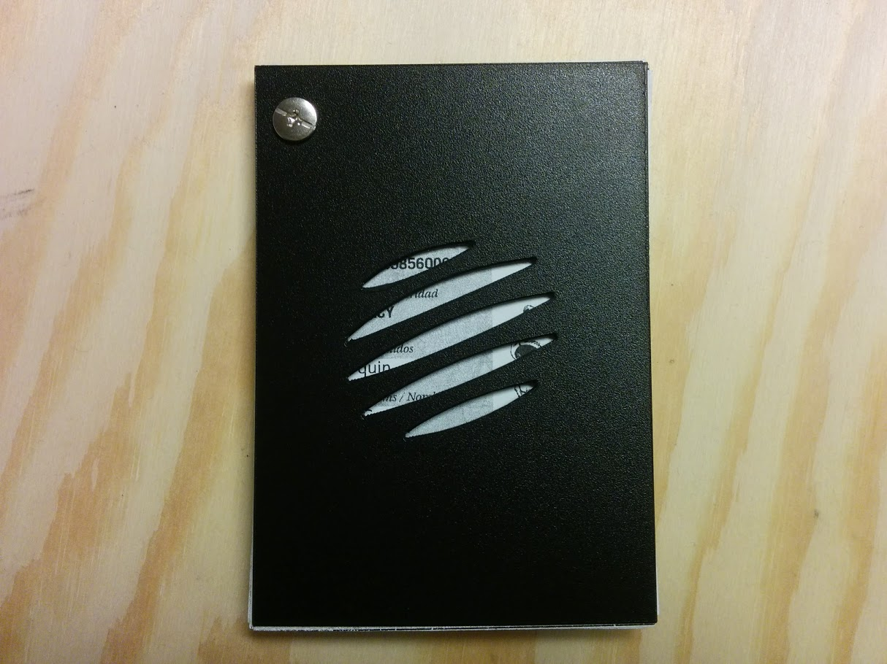

## What I've done yet.
I start from this type of binding  
https://vimeo.com/81178782   
I spend some time to try to found the right way to use scribus to manage to have the right page order from printed A4 folded and cuted in a A6 booklet -> passeport.sla then passeport A4.sla is quite ok, I just print the pdf on recto/verso A4. 
But I would like to have a better fit for the layout and a bit resize it like a passport who is slightly smaller than A6. 
- [x] Redimensionner format A6 (~15x10 cm) au format légal passeport un poil plus petit qui semble être un standard proche aussi des carnets moleskin, plus adapté à presque toutes les poches.   
Trou de 5mm diam, écart 80mm  
- [x] 81 par 114 mm = format C7 dans inkscape. Yes, ça marche avec seulement une seule perforation.   http://www.formatpapier.fr/enveloppe-format-c.html
- ~~Taille 84x136mm. 136 correspond au réglage minimum standart de ma perforatrice (réglage 888) et 84 = proportion dorée de 136.~~ Format portrait incompatible avec le type de reliure à vis prévue actuellement. C'est chiant pour écrire, la reliure prend trop de place. 
- ~~Taille 136x328 ([silver ratio](https://en.wikipedia.org/wiki/Silver_ratio))~~ Trop long
- ~~Taille 136x220 ([golden ratio](https://en.wikipedia.org/wiki/Golden_ratio))~~ Trop long, 1cm trop grand pour la largeur de l'A4
- ~~Taille 136x210~~ trop grand, presque A5
- ~~Carrée, 98x105?~~ Mouais...  

~~Est-ce que cette reliure par vis est bien la solution? ça semble mieux adapté à des formats plus grands.~~

### TodoList
Les pages à éditer:
- [x] Credits
- [ ] Badges (we could go for something connected to [OpenBadges](https://openbadges.org/) )
- [ ] [Charte/Manifesto](https://github.com/openfab-lab/passeportMaker/blob/master/contenu/charte%20pg2.txt)
- [x] ID
- [ ] Tasks (linked to github issues)
- [ ] cheatsheets, for exemple like this:

![engineer mini book] (/REFERENCE/Engineer%20mini%20notebook%20ref.jpg)

### passeport V2 cover
The cover is lasercutted and sew but the next one will be easier and binded with acounting screw, so it's easier to reorder and add some pages when needed. 
   

### passeport V3 - easy in the pocket!

    
  
   

Still need work on the inside layout for pages. For stamp, for the use of it... well it still need a lot of work.

